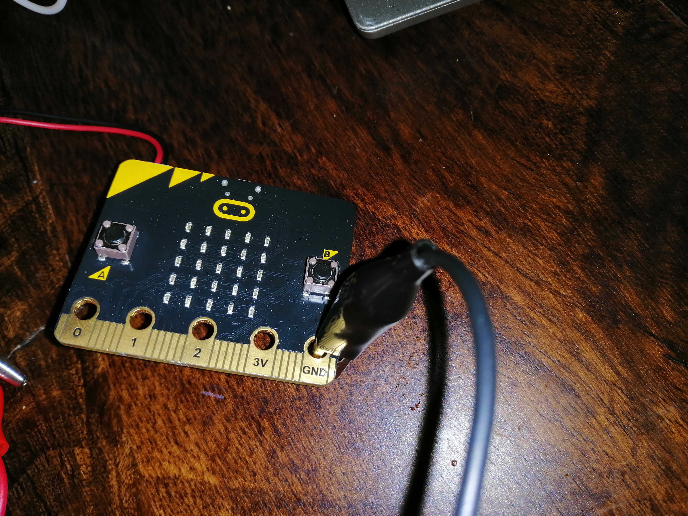

# Assessment 1: Replication project

*Fill out the following workbook with information relevant to your project.*

*Markdown reference:* [https://guides.github.com/features/mastering-markdown/](http://guides.github.com/features/mastering-markdown/)

## Replication project choice ##

Banana Keyboard

### Related project 1 ###
Paper Keyboard

https://drive.google.com/file/d/1dgUUIEMWrP4NXYAxSSu5Rrd2ygb8OVcj/view

This project is related to mine because it is the same concept and uses the same technology but on a bigger scale.

## Interaction flowchart ##

## Process documentation
Connecting the first aligator clip to the ground.

Connecting the the second aligator clip to 0.

Connecting the first and second clips to the earphones (ground at the base and 0 at the tip).

Connecting the thrid aligator clip to the firts clip which is connected to the ground.

Connecting the last aligator clip to 1.

Connecting the apples.

## Project outcome ##

### Project title ###
Banana Keyboard
### Project description ###

The banana keyboard (apple keyboard in this case) is a muscial and entertainment project that uses the microbits functionality to make sounds with fruit. When a person touches or tries to pick up one of the fruits connected to the microbit it will make a sound. In an effort to surprise the users, the microbit is hidden to the user. This will add to the entertinment side both for the unknowing user and other people watching. 

### Showcase image ###

### Additional view ###

### Reflection ###

Overall the project went smoothly and was easy to complete. The hardest part was finding aligator clips and other parts which were hindered by the COVID-19 effects on the economy and the shut down of all non essential activities. Along with that I found it hard to justify going into the workshops for fear of some how catching the virus. I found that this project gave me a greater understanding of the microbit and its processes. Something I found interesting was the incorporation of headphones into the project to output the sounds. It makes me curious about what other non microbit parts could be used in future projects. 
